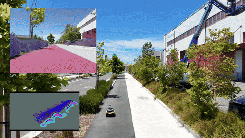
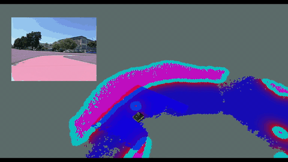
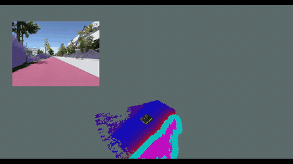
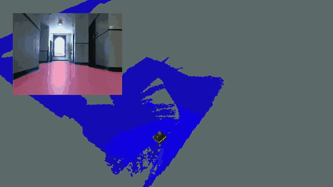
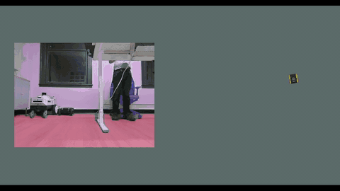
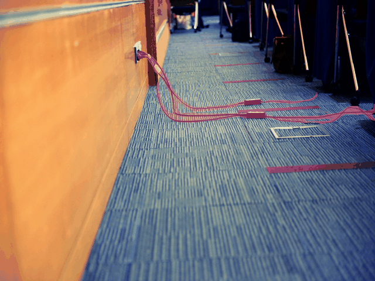
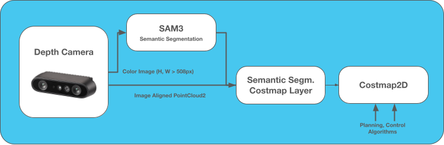

# Semantic SAM3 Navigation on AMD Strix Halo

This repository hosts a demonstration of using generalized semantic segmentation for autonomous navigation with [Nav2](https://docs.nav2.org/), running on the edge on a [AMD Strix Halo](https://www.amd.com/en/blogs/2025/amd-ryzen-ai-max-personal-ai-supercomputing-guide.html) using Meta's [SAM3](https://ai.meta.com/sam3) foundation model for text-prompted semantic segmentation. It turns a camera stream into a live, locally-run text/image-based segmentation of the robot's environment that Nav2 can reason about for **terrain-aware navigation**, detection of **small or otherwise hard-to-see obstacles**, **changing situational context**, and handling of **dynamic obstacles**, and much more.

<p align="center">
  <a href="https://youtu.be/a4E9vwTxbZE"></a>

  Click on the gif to see the full video!
</p>

This enables applications to:

  * Make trade-offs in planning and control about navigating via certain surfaces over others. For example, prefer sidewalks over grass (while strictly avoiding street), prefer wide open areas over confined aisles, avoid spills or puddles where possible, etc.

  * Detect small objects on the ground (i.e. cables, debris) or far away objects difficult to pick up on depth cameras or lidars important to an application, in a generalized way without having to know every possible object you may encounter

  * Make decisions about the nature of the situation the robot is currently in to adjust its behavior or algorithms. For example if in confined vs open space, in an area approaching another robot/human/vehicle, or treating particular objects differently. Might be useful in behavior trees ;-) 

  * Find common dynamic objects without training on each specific type to remove from the static scene for dynamic tracking and/or localization improvements.

  * The list goes on! If you can imagine it, it can be integrated into a behavior tree, navigation algorithm, or costmap layer. Doubly so for application-specific tasks.

This demonstrates state-of-the-art foundation model workflows using AMD's Strix Halo - which is also capable to perform workloads on the edge like Detection, Segmentation, VLMs, VLAs, LLMs, and more with 32 powerful x86 CPU cores to boot. The newest generations of AI-enabled processors are absolutely amazing for robotics (NPU, GPU, FPGA, 32x x86 cores) workloads.

**⚠️ Need ROS 2, Nav2, or deployment help? Contact [Open Navigation](https://www.opennav.org/)! ⚠️**

SAM3 is a state-of-the-art _text-promptable_ foundation model. It accepts text prompts regarding what to segment from the image ("person", "pallet", "wet floor sign", "curb", "mud", "ceiling", ...) and it returns masks for each class and ID of each object within a class. Gone are the days of fixed detectors or segmentation algorithm classes: the same model can be used at run-time to find various environments, objects, surfaces, and more without retraining (and may be dynamically changed at run-time too!). Combining this with Nav2's costmap, behavior tree, and/or algorithm plugins, SAM3 is extremely powerful and empowers intelligent applications to be developed understanding the world more fully. This enables the robot to make decisions about navigation or behaviors driven not by obstacles but by rich semantic context.

| Prompts | New detect every frame (ms) | New Detect every 1s, track between |
| ------- | ------------------ | --------------------- |
| 1       |  154.6 (6.46 Hz)   |  103.8 (9.63 Hz)      |
| 2       |  183.3 (5.45 Hz)   |  136.0 (7.35 Hz)      |
| 4       |  305.6 (3.27 Hz)   |  211.3 (4.73 Hz)      |

The choice of redetecting each frame or not can depend on the FOV of the sensor and how dynamic your environment is. **5-10 Hz for a server class semantic segmentation algorithm is very impressive on the Strix Halo!** 

## Real-World Tech Demonstrations

These demonstrations shows **terrain-aware navigation** using SAM3's semantic segmentation to give the robot a rich understanding of the surfaces and objects around it. This provides context and intelligence far beyond what a depth camera or lidar alone can provide.

Traditional depth-only perception tells you where obstacles are, but not what they are or how you should treat it. It also struggles with small or thin obstacles (cables, low curbs, debris) and distant objects beyond its effective range. Semantic segmentation fills this gap by labeling every pixel with what it actually is, even in situations where depth is out of range.

With terrain labels in the costmap, the robot can do all of the main applications described above: prefering certain surfaces over others, detecting small or hard to see obstacles, or treating particular objects differently in perception, planning, control, or localization pipelines.

These demonstrations are performed in a few unique cases to showcase the value of terrain segmentation. In each, we configure the SAM3 inference node & semantic segmentation layer with slightly different prompts and costs. We can do so without any fine-tuning or retraining to segment out the surfaces or objects of interest in each. We also perform navigation without the use of other costmap layers (semantic segmentation only!), but that should be considered for deployed applications.

SAM3 does an amazing job on Day 1 with no fine-tuning or detailed prompt-engineering across a huge variety of terrain types and environments, which is a game-changer for navigation in unstructured environments.

### Outdoor Terrain

These demos showcase detecting outdoor drivable ground surfaces (cement, pavement, sidewalk) while avoiding the street, grass and other non-navigable surfaces.
We segment human-created surfaces using `"sidewalk, cement, or pavement"` in a park & street-side sidewalk environment & label `"grass or plants"` as illegal cost to avoid.
It does well on sidewalks, blacktop, concrete pavement, and even gravel paths.


<p align="center">
  <a href="https://youtu.be/6vNGW-jOVkI"></a>
</p>

<p align="center">
  <a href="https://youtu.be/9JsDWNHVmWg"></a>
</p>

### Indoor Terrain

This demonstration segments the floor simply using `"floor"` and walls using `"wall"` in an office environment.
It does a perfect job, essentially even mapping the freespace of the room without any fine-tuning or even sophisticated prompt engineering.
This, however, obviously ignores other objects in the scene like trash cans, chairs, desks, etc which are necessary to consider for a complete navigation solution.

<p align="center">
  <a href="https://youtu.be/UQdmIIM90WI"></a>
</p>

You can do more than just two classes though to get really nice semantic information about the environment. For example, this demonstraion segments out the `["floor", "wall", "desk", "chair", "shelf or cabinet"]` to give a much richer understanding of the environment for navigation and behavior decisions.
Note the color changes for relative costs of various objects and surfaces to highlight the differences (even if a little subtle).

<p align="center">
  <a href="https://youtu.be/jL1m8J5KgRs"></a>
</p>

### Bonus: Some Motivating Ideas!

We all know in our various environments (warehouses, homes, construction, agriculture, etc) there are constantly small and nuanced things on the ground we need to contend with. Now with this integration you can detect and avoid them without any fine-tuning!

<p align="center">
  
</p>

You can find these examples in the `scripts/image_testing/` directory with a test script to easily evaluate a directory of images for evaulation.

There are many uses of semantic data from SAM3. Applications can use it for things like behavior enhancement based on situational awareness, localization pipeline improvement, extracting dynamic obstacles for tracking, and so forth. This demonstration of one such pipeline using it for terrain-aware navigation.

## Package Structure

This repository is layed out as the following:

*  `opennav_sam3_inference`: the ROS 2 node optimized for Strix Halo that hosts SAM3, subscribes to a camera topic, and publishes segmentation masks as an overlay image and labeled masks for use in downstream applications.
*   `opennav_sam3_msgs`: message and service definitions (e.g. `ChangePrompt.srv`) used to reconfigure the segmentation node at runtime.
* `semantic_segmentation_layer`: A symlink to the semantic segmentation layer used to project the 2D segmentation mask into the costmap frame and set relative environment costs for terrain-aware navigation and detecting small or otherwise hard-to-see obstacles
* `opennav_sam3_nav_demo`: A demonstration of Nav2 configuration used to navigate with local semantic data

The demonstration software used is in the main [Honeybee repository](https://github.com/open-navigation/opennav_amd_demonstrations), so this repository only contains the general software useful for integrating SAM3 into an arbitrary robot application. See that project for Nav2 configurations, the demonstration autonomy applications, and related.

## Integration Architecture

The pipeline follows a straightforward data flow from camera to costmap, as shown below using an Orbbec Gemini 355 RGBD camera:



The only requirement is that the camera images are undistorted and the pointcloud is aligned / synchronized with the color image, thus a standard depth camera is recommended. The resolutions should also match before passing into the costmap layer. However a high quality color image for segmentation can work with lower-resolution depth as long as SAM3's outputs are decimate to the pointcloud's size. See `sensor_processing_pipeline.launch.py` for an example of the pointcloud rectification and `~/label_mask` resizing.

The SAM3 node will output a label mask and semantic overlay (for debugging) containing the detected text prompts. The node can process multiple different text prompts to detect many different classes, however the performance will drop proportionate to the number of text prompts. Conveniently, prompts can be arbitrarily long, so a single one may represent multiple different classes as long as you want to treat them the same.

For example:
* `["grass", "sidewalk", "car", "street", "bicycle"]` is 5 prompts that will each be assigned specific classes
* `["person, child, dog, or bicycle", "car, bus, plane, motorcycle", "grass, sidewalk, street, or parking lot"]` would only be 3 prompts but represent multiple physical classes as a single class ID 

Once the semantic data is in the costmap layer, the costmap costs used by planning, control, and behavior algorithms will be adjusted based on the cost to traverse a particular terrain class (from none, to some, to illegal). This incentivizes the robot to select terrains to plan through or select trajectories within based on your desired behavioral characteristics. 

From our experience, you may want to consider using either a stereo camera set with a large disparity & FOV or multiple depth cameras to fully capture the semantic richness of a scene. While a single Orbbec / Realsense can run this fine, it may not provide as much semantic context as you would otherwise like.

## SAM3 on AMD Strix Halo

The SAM3 semantic segmentation node publishes three outputs:

| Topic | Type | Description |
| --- | --- | --- |
| `~/label_mask` | `sensor_msgs/Image` (`mono8`) | Pixel value = `class_id` of the top-scoring class at that pixel; `0` means no detection. |
| `~/label_info` | `vision_msgs/LabelInfo` | Maps `class_id` to `class_name` for use of `label_mask` downstream. |
| `~/segmentation_mask` | `sensor_msgs/Image` (`rgb8`) | Per-class-tinted overlay of the source frame for validation. Colors are deterministic per `class_id` |

Two services let you steer the node without restarting:

| Service | Type | Description |
| --- | --- | --- |
| `~/change_prompt` | `opennav_sam3_msgs/srv/ChangePrompt` | Replace the prompts & class_ids live (e.g. `[("person", 1), ("pallet", 2), ("puddle", 3)]`). |
| `~/enable` | `std_srvs/srv/SetBool` | Pause / resume inference. |


All parameters are declared in [`opennav_sam3_inference/config/sam3_inference.yaml`](opennav_sam3_inference/config/sam3_inference.yaml) and can be overridden via the `params_file` launch argument.

The following parameters are also provided:

| Parameter | Type | Default | Description |
| --- | --- | --- | --- |
| `checkpoint` | `string` | `path/to/sam3/model` | Path containing SAM3 model weights `model.safetensors` file |
| `onnx_dir` | `string` | `path/to/onnx/files` | Build artifacts with optimizations consisting ONNX files |
| `prompts` | `string[]` | `["object"]` | Text prompts to segment. Must be the same length as `class_ids`, with no duplicate entries. Swappable at runtime via the `~/change_prompt` service. |
| `class_ids` | `uint16[]` | `[1]` | Parallel array of class IDs for `prompts`. Each ID is written into the `~/label_mask` output at pixels belonging to that class and echoed in `~/label_info`. Must be in `[1, 255]` (0 is reserved for "no detection") and unique. |
| `device` | `string` | `cuda` | Torch device string. `cuda` is correct on ROCm (PyTorch reuses the CUDA device namespace for HIP). Falls back to `cpu` if no accelerator is available. |
| `score_threshold` | `double` | `0.5` | Minimum confidence score for a detected instance to be emitted. Live-editable, validated to `[0.0, 1.0]`. Echoed in `~/label_info.threshold`. |
| `mask_threshold` | `double` | `0.5` | Per-pixel threshold applied when binarizing the predicted mask. Live-editable, validated to `[0.0, 1.0]`. |
| `queue_depth` | `int` | `5` | History depth for the `~/segmentation` and `~/label_mask` publishers. The `~/image` subscription uses a fixed `depth=2`, `BEST_EFFORT` profile so stale frames are dropped — real-time perception wants latest-frame-wins. |
| `start_enabled` | `bool` | `true` | If `false`, the node loads and compiles the model but returns early from the image callback until `~/enable` is called with `data: true`. |
| `max_objects_per_prompt` | `int` | `5` | Cap on simultaneously tracked objects per prompt. Excess (lowest score) are evicted via session.remove_object so the tracker stops propagating them. |
| `redetect_interval_ms` | `double` | `1000.0` | Wall-clock interval between full SAM3 detections. `0` runs SAM3 on every frame (most accurate, slowest); `>0` runs SAM3 on keyframes every N ms with tracker propagation in between (recommended for multi-prompt). |
| `bootstrap_frames` | `int` | `0` | Text-bootstrap → box-prompt: number of initial text-mode keyframes used to capture exemplar boxes, which are then injected as box prompts for stable multi-prompt tracking. `0` disables (pure text-prompt). |
| `bootstrap_min_score` | `double` | `0.3` | Minimum detection score for a box to be captured as a bootstrap exemplar. |
| `periodic_rebootstrap_seconds` | `double` | `180.0` | Force a re-bootstrap every N seconds wall-clock to catch scene changes the score-only drift signal cannot detect. `0` disables. |

We want to especially thank Harry Sun at AMD for doing an incredible job with the SAM3 tracker implementation in collaboration with this work.

#### Get Access to SAM3

If you have not already, you must create a hugging face account and do the following:

* Accept license at https://huggingface.co/facebook/sam3
* Get token from https://huggingface.co/settings/tokens 

#### Build and Run Node

Refer to the [README](opennav_sam3_setup/README.md) inside `opennav_sam3_setup` for instructions on setting up the environment before the following steps.

See the node parameters in `sam3_inference.yaml` and set the `checkpoint` and `onnx_dir` paths to the one used in setup. Also configure the classes and detection parameters for SAM3.

##### First time build

Build the `opennav_sam3_msgs` package first since the following packages depends on it.

```bash
colcon build --packages-select opennav_sam3_msgs && source install/setup.bash
```

Then build just the `opennav_sam3_inference` package inside the conda environment created by the setup script. By default it's `opennav-sam3-inference`.

```bash
conda activate opennav-sam3-inference
colcon build --packages-select opennav_sam3_inference
conda deactivate
```

Outside the conda environemnt, build everything else as usual while skipping just the `opennav_sam3_inference` package

```bash
colcon build --packages-skip opennav_sam3_inference
```

Now you can source the workspace as usual and launch the inference node, even outside of the conda environment!

##### Rebuilding packages

- Always build the inference package `opennav_sam3_inference` inside the conda environment.
- Build everything else outside the conda environment excluding the inference package.

##### Run the inference stack

```bash
ros2 launch opennav_sam3_inference sam3_inference.launch.py
```

>If the camera color image and pointcloud are already aligned from the sensor, please add `sensor_processing_pipeline:=false` to 
>the above command to avoid overhead from redundant processing.

>Inference node uses images from `/sensors/camera_0/color/image` topic by default.

## Related Projects

*   [opennav_amd_demonstrations](https://github.com/open-navigation/opennav_amd_demonstrations): companion project demonstrating indoor 2D, urban 3D, outdoor GPS-based navigation, and now semantic segmentation navigation on Ryzen AI / Strix Halo computers with the Honeybee reference platform.
*   [Nav2](https://github.com/ros-navigation/navigation2): the ROS 2 navigation stack this work plugs into.
*   [Ryzers](https://github.com/AMDResearch/Ryzers): Pre-configured and optimized docker images for AI on AMD GPUs
